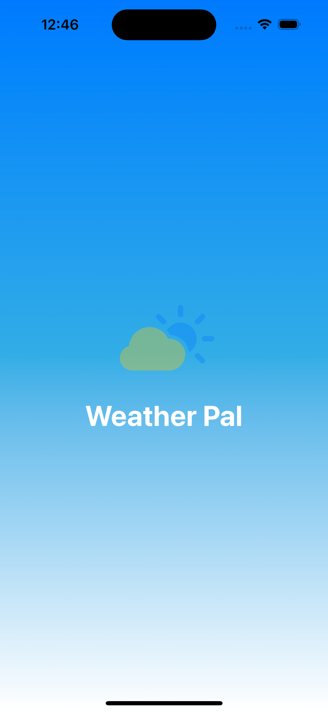
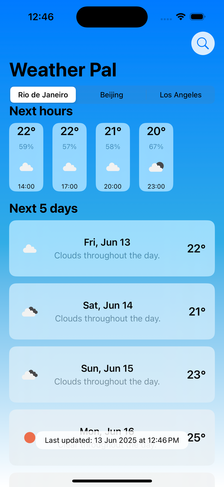
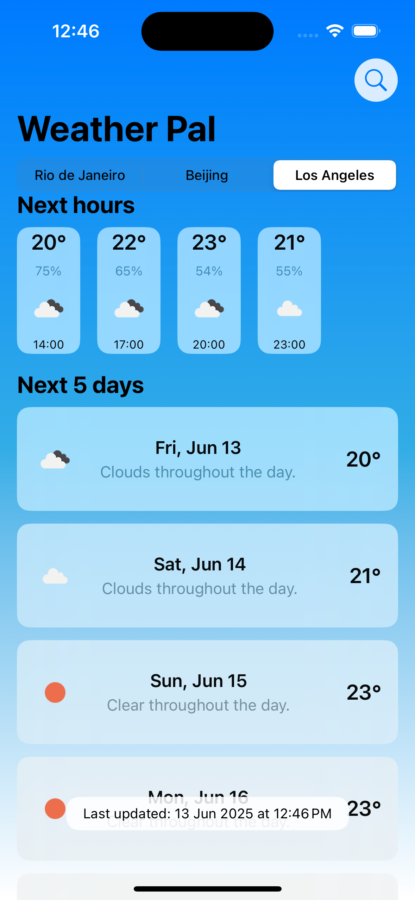
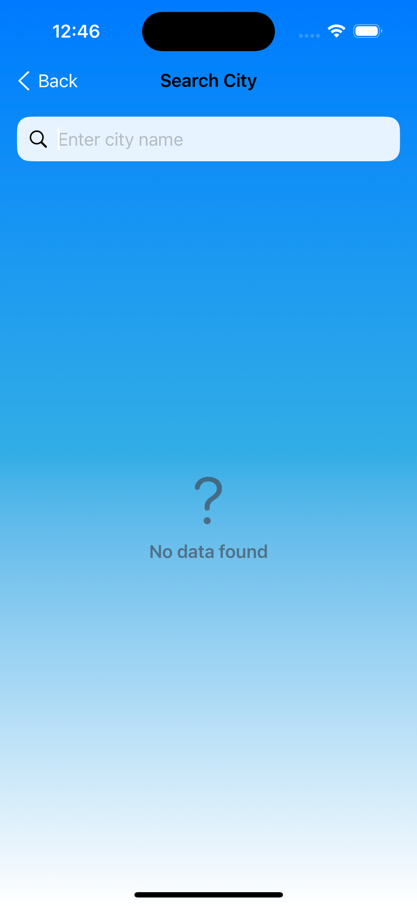
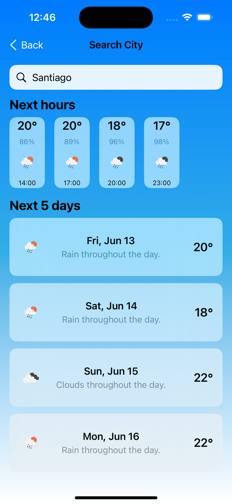

# Weather Pal

A modern weather app developed by **Daniel Romero**.

## Tech Stack
- **SwiftUI** (iOS 17+)
- **SwiftData** for persistence
- **MVVM Architecture**
- **Native Networking** using `URLRequest`

## Overview
Weather Pal is designed for clean, maintainable, and robust code. It leverages the latest SwiftUI APIs, and follows the MVVM pattern for clear separation of concerns. Networking is handled natively with URLRequest for reliability and performance.

## Next Steps

- Use SwiftData for local storage (offline mode)
- More coverage

---

## Screenshots

  
  
  
  
  

  <b>Splash</b> &nbsp; | &nbsp; <b>Home 1</b> &nbsp; | &nbsp; <b>Home 2</b> &nbsp; | &nbsp; <b>Search 1</b> &nbsp; | &nbsp; <b>Search 2</b>

© 2025 Daniel Romero 